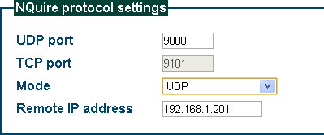

== Server communication

The server communication is done by UDP and/or TCP. The TCP connection can be in server mode or in client mode. In server mode the NQuire will listen to connections on the configured TCP port, whereas in client mode the quire will try to make the connection using the configured "remote ip address" and "tcp port".

There are two types of data traffic comming from the NQuire:

 - event messages: This is data generated in reaction to an event on the NQuire (e.g. a scanned barcode or a touchscreen keyclick) These messages are sent to all connected clients and possibly the configured server (UDP or TCP).
 - return data: This is data which is generated in response of executing an escape command. This is only send back to the client that issued the command.

 Depending on the configuration (webui), the barcode prefix will or will not be sent along with the barcode.

 Note that scanned mifare data is prefixed with `MF` followed by 4 bytes (binary data) containing the barcode id.

 Putting text on the NQuire is done by a (downwards) SG15 compatible protocol: the NQuire is able to do more, so the protocol is extended:

  -	The screen is bigger so "set pixel position" allows bigger values.
  -	"select font set" is extended: values 0x32 to 0x40 represent fonts from	6px to 96px with steps of 6px.
  -  various extra commands are defined (such as for controlling the touch screen)

 anchor:event-messages[event messages]

=== Protocol introduction

* TCP client

image::img/002.png[]

 the NQuire will try to make a TCP connection to /cit/remote_ip and /cit/tcp_port continuously. Event messages are send to the connection server. The NQuire accepts escape code commands from the tcp connection.

使用 TCP client，UDP port 设置无意义。

....
NQuire 一启动就向 192.168.1.201:9101（TCP服务器） 发起 TCP 连接，并试图保持该连接。当NQuire检测到该 TCP 连接断开后（比如TCP服务器重启），NQuire 将立即再试图建立起一条TCP连接。NQuire 扫描到条码后，将条码直接发往 TCP 服务器（不需再进行TCP连接的三路握手）——因为TCP连接之前已经建立。若之前TCP连接建立不成功（比如服务器已宕机），NQuire将告知应答失败（屏幕显示 Please Ask for Assistance）
....

* TCP client on scan

和 "TCP client" 相似。

 the NQuire will try to make a TCP connection to /cit/remote_ip and /cit/tcp_port when there is no connection yet, but only when something is to be send. Then the event message is send to the server. The NQuire accepts escape code commands from the tcp connection (when there is one).

....
不同之处是 NQuire 仅在有必要传输数据时才建立 TCP 连接；而 "TCP Client" 则是试图保持连接，不论当前是否需要传输数据。注意：当 NQuire 未与服务器建立 TCP 连接时，服务器无法发送数据给 NQuire。
....

* TCP server

image::img/004.png[]

此时 UDP port 和 Remote IP address 设置无意义。

 the NQuire will listen to incoming TCP connection on port /cit/tcp_port. Event messages will be send to all open tcp connections. The NQuire accepts escape code commands from TCP connections.
....
NQuire 开机后，无法将扫描到的条码发送出去（因为它不知道要发给谁），直到有一个客户（比如一台PC）向其发起了TCP连接，NQuire 才能发送数据，即发给那个 TCP 客户。
"TCP server" 不适合用在 NQuire。
....

TIP: 需要经常主动发送数据给他人的场合，而适合用在被动接受信息的场合。

* UDP

 events messages are only send using UDP to the configured server (/cit/remote_ip and /cit/udp_port). The NQuire accepts escape code commands from UDP messages.

该方式仅使用 UDP 进行通信，不使用 TCP ，因此 TCP port 设置无意义。
....
使用 UDP，没有"服务器"和"客户机"这种概念上的差别，你可以认为 NQuire 即是服务器也是客户机。
将 UDP port 设为 9000 的情况下，NQuire 一方面在 9000 端口接收对方发来的数据（是否只接受来自 192.168.0.201的），另一方面将要发送的数据发往 192.168.0.201:9000 。
....

TIP: UDP 对于 NQuire 和 PC 双方都可能会主动发出数据的场合比较适宜。

* client

image::img/006.png[]

the NQuire will try to make a TCP connection to /cit/remote_ip and /cit/tcp_port continuously. Event messages are send to the connection server and using UDP to the configured server (/cit/remote_ip and /cit/udp_port). The NQuire accepts escape code commands from TCP connections and UDP messages on port /cit/udp_port.

....
NQuire 同时行使 "UDP" 和 "TCP client" 的功能。
经试验，NQuire 扫描到条码后，会同时将数据发往 192.168.1.201:9000(UDP) 以及 192.168.1.201:9101(TCP) 。
....

* server

image::img/007.png[]

 the NQuire will listen to incoming TCP connection on port /cit/tcp_port. Event messages will be send to all open tcp connections and using UDP to the configured server (/cit/remote_ip and /cit/udp_port). The NQuire accepts escape code commands from TCP connections and UDP messages on port /cit/udp_port.
....
NQuire 同时行使 "UDP" 和 "TCP sever" 的功能。
....

=== Event messages

Event messages are sent to each connected host and, when UDP communication is enabled, to the configured server-ip.port address. This means that a connection which is used to send commands, will also get event messages.
However, an event message will never come inbetween a command and it's return message.

Event messages are seperated by the configured message separator (+/cit/message_separator+): +LF+,+CR+ or +CRLF+.

Messages are composed as follows (BNF):

-----
message ::= [ device_id ] { event_message | control_cmd_return_message }
device_id ::= <depend on /cit/enable_message_tag and /cit/message_tag>
event_message ::= prefix data
control_cmd_return_message ::= data
prefix ::= <see below>
data ::= <message specific>
-----

When /cit/enable_message_tag = true , then each message begins with a device identifier specified in /cit/message_tag.

Different event messages can be recognized by their prefix:

[cols="10,2,2,50",options="header"]
|===================================================
|Name|Prefix hid|prefix out|meaning

|Code128            |j|#|
|UCC_EAN-128        |u|P|
|EAN-8              |g|FF|
|EAN-13             |d|F|
|UPC-E              |h|E|
|UPC-A              |c|A|
|Interleaved-2_of_5 |e|i|
|Code39             |b|*|
|Codabar            |a|%|
|Code93             |y|c|
|PDF417             |r|r|
|QR_Code            |S|s|
|Aztec              |Z|z|
|DataMatrix         |U|u|
|Chinese-Sensible   |H|h|
|GS1_Databar        |R|R|
|ISBN               |B|B|
|Code-11            |z|Z|
|2_5-Matrix         |v|v|
|ITF14              |q|q|
|MSI-Plessey        |m|m|
|Plessey            |p|n|
|2_5-Standard       |s|o|
|2_5-Industrial     |i|o|
|USB                ||U|
When configuration option "/dev/extscanner/raw = true", the data as received from the external scanner is send to the server, prefixed with an 'U': no prefix translation is performed!
The data received on the USB is chopped in chunks. The chunks received from the USB are to be seperated by CR or LF.

|mifare             ||MF|
|timeout            ||T|in response to \e\fb.....\x03
|touch16            ||K|Configurable in /dev/touch16/prefix, default="K"
|gpio               ||I|Configurable in /dev/gpio/prefix, default="I"
|warning            ||W|some kind of warning about the state of the NQuire (see xref:error-codes[])
|===================================================

anchor:error-codes[error codes]

=== Error codes

Error codes are used in return and event messages. They are used to indicate errors and warnings. The exact usage is defined in the escape command or the event message.

-----
	'0'	OK
	'1'	Error (undefined)
	'2'	Error: Mifare card unavailable
	'3'	Error: Mifare Card access denied (incorrect key)
	'4'	Error: invalid message format
	'5'	Error: Mifare invalid card (mifare cardnum mismatch)
	'6'	Error: file system full (no space left to log).
	'7'	Error: Mifare format error in cardnum or transaction-id
	'8'	Warning: big-log-file detected (this can slow down the system). Please rotate and cleanup.
-----

NOTE: Error '6' (file-system-full) causes an error state for the file-system. The only way out it to reboot the NQuire and correct the situation by removing a file using ftp.

=== encryption

Traffic from and to the NQuire can be encrypted. The only encryption supported is base64 (not really encryption but it is no longer human readable text). This is configurable using config item: /cit/message_encryption

Default operation mode is 'none' in which case all messages are transmitted as they are.

When /cit/message_encryption = base64 , the following traffic is encoded:

    * All event traffic (barcode, mifare, touchscreen, gpio events) from NQuire attached clients is encoded in base64. The base64 lines are separated with the configured message separator (config item: /cit/message_separator). These are only for separating the base64 strings. The actual messages will contain the event(s). Each event ends with the configured message separator.
    * All escape code traffic to the NQuire is expected to be encoded the same manner.

NOTE: discovery packets are NOT encoded.
