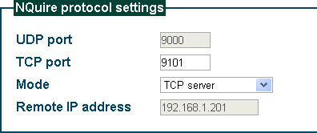

== 通讯协议介绍

与服务器的通讯可以是UDP或者TCP或者是两者的结合。

=== TCP client

使用 TCP client，UDP port 设置无意义。

....
NQuire 一启动就向 192.168.1.201:9101（TCP服务器） 发起 TCP 连接，并试图保持该连接。当NQuire检测到该 TCP 连接断开后（比如TCP服务器重启），NQuire 将立即再试图建立起一条TCP连接。NQuire 扫描到条码后，将条码直接发往 TCP 服务器（不需再进行TCP连接的三路握手）——因为TCP连接之前已经建立。若之前TCP连接建立不成功（比如服务器已宕机），NQuire将告知应答失败（屏幕显示 Please Ask for Assistance）
....

=== TCP client on scan

image::img/003.png[]

和 "TCP client" 相似。

....
不同之处是 NQuire 仅在有必要传输数据时才建立 TCP 连接；而 "TCP Client" 则是试图保持连接，不论当前是否需要传输数据。注意：当 NQuire 未与服务器建立 TCP 连接时，服务器无法发送数据给 NQuire。
....

=== TCP server

此时 UDP port 和 Remote IP address 设置无意义。
....
NQuire 开机后，无法将扫描到的条码发送出去（因为它不知道要发给谁），直到有一个客户（比如一台PC）向其发起了TCP连接，NQuire 才能发送数据，即发给那个 TCP 客户。
"TCP server" 不适合用在 NQuire。
....

TIP: 需要经常主动发送数据给他人的场合，而适合用在被动接受信息的场合。

=== UDP

image::img/005.png[]

该方式仅使用 UDP 进行通信，不使用 TCP ，因此 TCP port 设置无意义。
....
使用 UDP，没有"服务器"和"客户机"这种概念上的差别，你可以认为 NQuire 即是服务器也是客户机。
将 UDP port 设为 9000 的情况下，NQuire 一方面在 9000 端口接收对方发来的数据（是否只接受来自 192.168.0.201的），另一方面将要发送的数据发往 192.168.0.201:9000 。
....

TIP: UDP 对于 NQuire 和 PC 双方都可能会主动发出数据的场合比较适宜。

=== client

....
NQuire 同时行使 "UDP" 和 "TCP client" 的功能。
经试验，NQuire 扫描到条码后，会同时将数据发往 192.168.1.201:9000(UDP) 以及 192.168.1.201:9101(TCP) 。
....

=== server

image::img/007.png[]

....
NQuire 同时行使 "UDP" 和 "TCP sever" 的功能。
....
