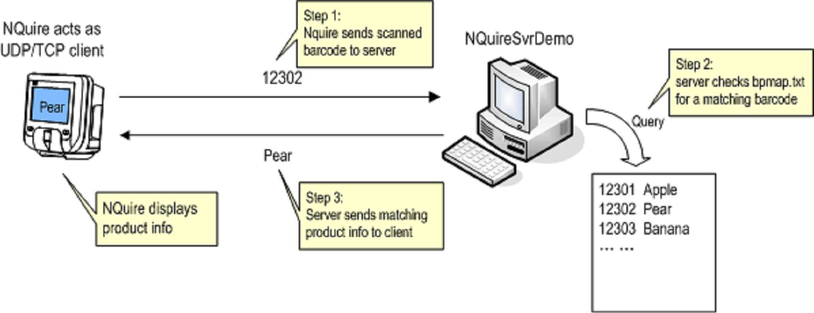
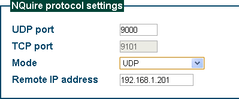
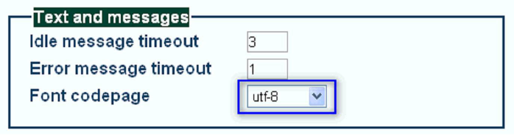

== Demo

This demo program is a TCP and UDP server that is used with Newland NQuire 200 to demonstrate how NQuire 200 works. You can know
the communication protocol between NQuire and the server.

This program is provided AS IS. Don't use this program for production purpose.

=== Applicable devices and environment

NQuireSvrDemo itself can be run on Windows 2000/XP/Vista/7(called server PC below).
The server PC and the NQuire must have an IP network connection so that network data can be sent and received between the two.
This demo program has been tested to work with NQuire application version 2.0 .

=== How to run the demo

Working procedure of NQuireSvrDemo is shown in the following figure:
Preparation:

Preparation:

* Find out the IP address of your PC on which NQuireSvrDemo will run.
* Find out the IP address of NQuire.
* From your PC, use ping command to confirm NQuire is reachable on your network.
* Get some barcodes at hand to be scanned by NQuire later.

Configure NQuire side:

* On your PC, use web browser to access NQuire's configuration.
* On Network section of the web configuration, under NQuire protocol settings sub-section,

** set Mode to UDP or TCP client .
** and set Remote IP address to your PC's IP address .
** Leave UDP port and TCP port at their defaults, 9000 and 9101 respectively . You can set the port as you will, if so, you
should change the port parameters for NQuireSvrDemo accordingly.

* Click "Apply settings" to save your changes above.

NOTE: If you set Mode=UDP with UDP port 9000, NQuire will send data to PC's UDP port 9000 and receive data arriving at its own UDP 9000 port.

Configure PC side:

* Prepare a bpmap.txt in the same directory as NQuireSvrDemo.exe. bpmap.txt provides barcode-to-product mapping for the server
program. bpmap.txt consists of one or more text lines, each line starts with a barcode string, then spaces/tabs, then the product info.
If a barcode is received by the server program and the barcode exists in bpmap.txt, the corresponding product info string will be sent
back to the client(i.e to NQuire).

** You can use the bundled bpmap.txt.sample file as a sample of your bpmap.txt. But remember to replace the sample barcode strings
with the actual barcodes at your hand.

* Open a command prompt window(the console window), and cd to the directory where NQuireSvrDemo.exe resides.

* Run NQuireSvrDemo without any parameter, you can get help messeage about its parameter.

* Now, run NQuireSvrDemo with the following parameters:

-----
    NQuireSvrDemo 9000,9101 0 log
-----

then NQuireSvrDemo will start to listen to NQuire's query, on UDP port 9000 and on TCP port 9101.

Console window displays something like:
-----
Demo server program for Newland NQuire
Program compile date: Aug 4 2010 10:45:53
bpmap.txt loaded, 4 items in product list.
Configuration:
TCP clients will be kept until explicitly requested.
received barcode data will be dumped to stderr.
(Press ESC to quit.)
Start listening on UDP port 9000.
Start listening on TCP port 9101.
-----

Now you can start scanning a barcode with NQuire. If no error occurs, you'll see:

1. NQuireSvrDemo prints on console window the barcode 1. it receives from NQuire.
2. NQuire display on its screen the product info corresponding to that barcode. If no matching barcode found in bpmap.txt, the server
will tell NQuire to display "No such product!" .

If network was not setup correctly, NQuire will not be able to receive any prompt response after scanning a barcode, in this case, NQuire
displays an error message "Please Ask for Assistance" .

==== More details

For a bpmap.txt line like this,

-----
12302 Pear
-----

On server's receiving 12302 , it actually tells NQuire to display two lines. First line is the barcode itself(this is the hard-coded behavior in NQuireSvrDemo); the second line is the product info text following 12302 ( Pear in this case ).

In order to customize the display of product info, you can consult NQuire's manual to utilize NQuire special commands to fine tune the
display. For example, if you don't want the echoed barcode and want Pear to be displayed at center position, you can write the text line as

-----
12302 <ESC>$<ESC>.<34>Pear<03>
-----

* <ESC>$ clears the screen, thus clear the echoed barcode.
* <ESC>.<34> means aligning text at center of NQuire screen. <03> is required to close the text align command.

==== Special token in bpmap.txt

If a barcode is found in bpmap.txt, the bytes(so-called product info text) after [the barcode string and the separating spaces/tabs] in the very
line are sent as TCP bytes to the client. But there are a few special tokens which will get replaced before sending.

* <ESC> will be replaced with one byte 0x1B .
* Text token like <XY> (where X, Y are both alphanumeric character, i.e. 0-9, A-F, a-f) will be replaced with byte whose hex value is
XY . For example, <34> means a byte with value 0x34, writing '<34>' is the same as writing '4' , <0D> is carriage return. Tip: <80> can be used to denote the Euro(€) sign when NQuire is configured to use ibm852 charset.
* <00> is special, and it will be not be replaced.

Example, for a line

-----
12302 <ESC>$<ESC>.<34>Pear<03>
-----

Product info text will be translated into UDP/TCP bytes 1B 24 1B 2E 34 50 65 61 72 03 , ten bytes total.

Use an asterisk as barcode string to represent "not matching barcode". That is, with a line

-----
* Product not found!
-----

when an input barcode cannot get a match in bpmap.txt, "Product not found!" will be sent by NQuireSvrDemo .

==== How to have NQuire display Unicode characters

NQuire is capable of displaying Unicode characters, such as traditional and simplified Chinese characters. In order for it to do so, you have
to configure NQuire to use utf-8 character set(charset).

More to note: SD card containing Unicode font file should be inserted into NQuire to actually display complex characters(Chinese etc).
Otherwise, complex characters will be display as a small square box.
It is OK to test Unicode character display with NQuireSvrDemo, but you need some special action:

1. Save bpmap.1. txt in UTF-8 encoding.

2. Leave the first line of bpmap.txt blank or fill some arbitrary characters on first line. If you write a barcode at first line, that barcode will be mixed with UTF-8 BOM bytes(EF BB BF) and fail to get recognized by NQuireTcpsvrDemo.

3. Start adding your barcode at second line of bpmap.txt.

==== Some hints

NQuireSvrDemo is a concurrent server, that is, it can serve multiple TCP connections and UDP clients at the same time.
Press ESC key on the console window and wait for one second to quit NQuireSvrDemo gracefully.
Since NQuireSvrDemo v1.3, whenever you changes bpmap.txt, NQuireSvrDemo will detect that change and reload it automatically. When
this occurs, you'll see a text line on the console window saying:

-----
INFO: bpmap.txt change detected and reloaded(4 items in list).
-----

=== Known problems

Program behaviors that are by design:

1. NQuire cannot send 4-byte sub-string "<34>" etc to client, because "<34>" is used to denote one byte of value 0x34.

2. The above limitations help keep bpmap.txt simple to compose.
Total number of items in bpmap.txt is limited to 1000.
